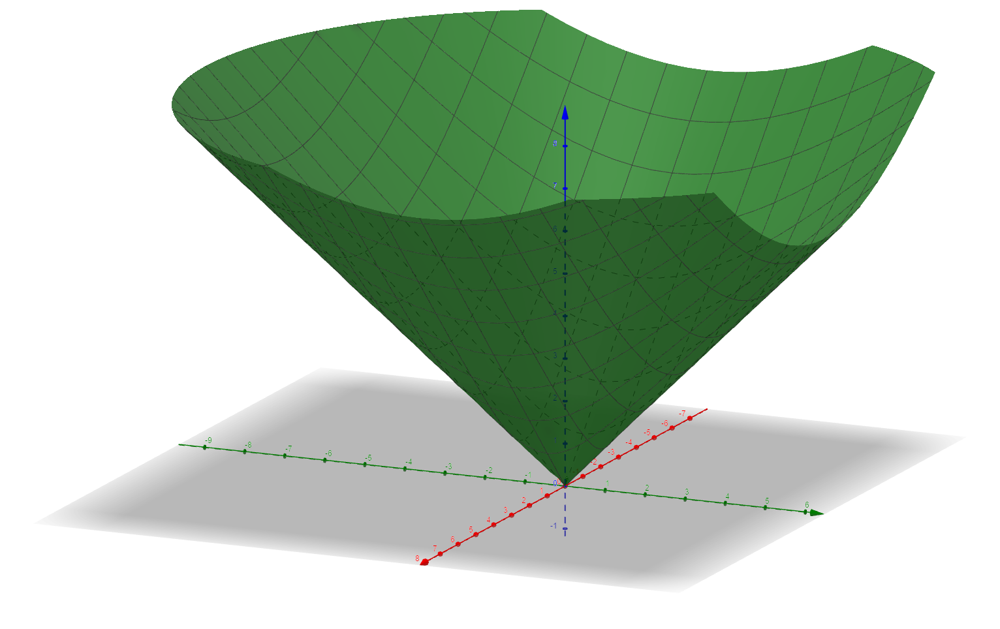

# 最优化算法-2025秋

最优化算法是人工智能、数据科学等相关专业基础课程。
本课程从优化问题的建模出发，主要介绍不同优化模型的建模技巧，求解思想，算法步骤，也兼顾对基本的优化理论学习。
课程内容包括了连续和离散优化，以无约束优化，线性规划和整数优化为重点内容。
学生将掌握如果通过最优化模型和相关求解工具解决工程、生活中的问题，此外，本课程也是学生未来学习高级优化技术（如凸优化，组合优化）和高级工程技术（如机器学习、数据分析）等相关课程的基础。

# 大纲
1. 一维无约束优化
    - 案例： 炼钢问题中的参数设计
    - Goldensection, 斐波那契法，二分法
    - 牛顿法，割线法，二次拟合法
1. 多维优化基础
    - 线性代数和矩阵基础回顾：二次函数，正定矩阵，范数等
    - 梯度
    - 黑塞矩阵    
1. 多维无约束规划-案例及最优性条件
    - 案例：常见的统计回归
    - 最优性条件
    - 下降法，Wolf近似条件
    - 梯度法，共轭法
    - 牛顿法，拟牛顿法
1. 有约束规划
    - 案例：SVM线性分类器
    - 一阶最优性条件、KKT条件
    - 拉格朗日对偶问题、弱对偶和强对偶性质
    - 线性约束：投影法
    - 外点法，内点法
1. 线性规划
    - 案例：$L_1$, $L_{\infty}$线性回归，线性SVM
    - 单纯形法
    - 对偶问题及对偶性质
    - 对偶单纯形(optional)    
1. 整数规划
    - 案例:选址问题，旅行商问题，工业切割问题
    - 线性松弛、完全幺模矩阵、网络流.
    - Rounding和其他算法
    - Gomory割平面法
    - 分支定界    
1. 启发式搜索
    - 随机搜索
    - 模拟退火
    - 粒子群算法
    - 遗传算法

# 前序课程要求
线性代数，程序设计基础

# 教学ppt

| 日期 | 课程内容     | 课堂PPT | 作业下载 | 
| -----------| ----------- | ----------- |----------- |
|2025年9月1日 | 绪论        | [PPT](https://1drv.ms/b/c/8ab0915549b5851f/EfG1sbHVWbtMt_Hwcp45sQ4BkLDjYcjBzhfduZMhZimxpQ?e=DWXSoe)| 无 |
|2025年9月3日 | 一维搜索1     | [PPT](https://1drv.ms/b/c/8ab0915549b5851f/EZ5_4bddeKROqByvW-chrlMB1zOWTGMWYxpuhz83wYB2lQ?e=qjJZJ0)| 无 |
|2025年9月8日 | 一维搜索2     | [PPT](https://1drv.ms/b/c/8ab0915549b5851f/ERPCGOv1RetIqDzKKg6ANgYB1n_ZSYOrjrbLj_WNAKlhuA?e=0I2xFb)| 无 |
|2025年9月10日 | 基础知识-多维函数基础     | [PPT](https://1drv.ms/b/c/8ab0915549b5851f/EaGXa8je5IJDur9NJh-ZsK4B_zMHDLyQVDhcx6qMzBsOmA?e=GAAKUL) | [作业1](https://1drv.ms/w/c/8ab0915549b5851f/EZdaHvcnKWpAssEBFRifbt8BCmVE0D3ScuNxNrGYk_Qj8Q?e=Ba2pdi) |
|2025年9月15日| 凸集、凸函数和凸优化基础 | [PPT](https://1drv.ms/b/c/8ab0915549b5851f/ERShCf4gQP9MuuMjEEpBL-AButQxt63cQs9_f_a_UevQ4A?e=fAjQAt)|无|
|2025年9月17日| 无约束优化案例、基础；下降法 | [ppt1](https://1drv.ms/b/c/8ab0915549b5851f/EQWP3p4IpaRDq6qhs3W0HBMBEzktUkjOXWXqL11RFXEFfQ?e=1PmqgP)，[ppt2](https://1drv.ms/b/c/8ab0915549b5851f/Ef2ZXKP-3k1FrpnGoTt-HFsBGb4BHHN_Ymu-fY64GTF79w?e=dItdRR)|无|
|2025年9月22日| 无约束规划-一阶方法-梯度+共轭法 | [ppt](https://1drv.ms/b/c/8ab0915549b5851f/EbG08cxYHO5MgK0IH-rZKpEBJ_e0i1W6dxH-nWgSFMDedg?e=cWEfxF)|无|
|2025年9月24日| 无约束规划-二阶方法 -牛顿法-拟牛顿法 | [ppt](https://1drv.ms/b/c/8ab0915549b5851f/ERWdPZ1ZQf9FtSm7U31flgkB375uWrvnQOLERU1wiRdwSA?e=6cjjlS)|[作业2](https://1drv.ms/w/c/8ab0915549b5851f/EfY1C5Xxpu9OpNZdgY8K5TEBrzxahhkQnj2KQE-NbyRuZQ?e=LKboz9)|
|2025年9月29日| 习题讲解| 无 | 无|
|2025年10月11日| 有约束优化-案例，拉格朗日最优性条件 | [ppt1](https://1drv.ms/b/c/8ab0915549b5851f/EZG0DlQynjtKgRArDq5ai6IBFTDCLQZhz2jE0Wwc-GuN2Q?e=Yo3mzC) [ppt2](https://1drv.ms/b/c/8ab0915549b5851f/EbQUyxHoI7ZFrjRkPHlP8QYB2eAZmHpOEeS__3-LFjoNDQ?e=MBo1Ar)| 无 |
|2025年10月13日| 有约束优化-KKT最优性条件，对偶 |见上ppt2| 无 |
|2025年10月15日| 有约束优化算法-投影法，罚函数法，障碍法简介 | [ppt](https://1drv.ms/b/c/8ab0915549b5851f/ETutRGPlYi9JnaaPeWrsqRIBL7DV5h4WH9wTm3tbKi-rTw?e=aA8zUc) | 无 |
|2025年10月20日| 线性优化案例 | [PPT](https://1drv.ms/b/c/8ab0915549b5851f/EbNA7bUq4rVIk-YbzcQOMxMB4blm6WyrmZuUaegLz1xj2A?e=RVr94N) | [作业3](https://1drv.ms/w/c/8ab0915549b5851f/Ea0QXg_5R35DhBzovzJeXDQBeY_wqDzEPMzpYEljH4xekA?e=GTLS4Z) |
|2025年10月22日|线性优化标准型，原理|[PPT](https://1drv.ms/b/c/8ab0915549b5851f/EX_uS6GePd5EuhdPgOBrG-EBV9IRqF07vF-x1Bedmg8sWQ?e=Q6unal) | 无|
|2025年10月27日|单纯形法，二阶段单纯形|[PPT](https://1drv.ms/b/c/8ab0915549b5851f/EZh7_8B6maNIp6CSp8BlPekBfjFkoy6lbJJVpuM3gUM5rw?e=NIU4Hr) | 无|
|2025年10月29日|线性规划对偶|[PPT](https://1drv.ms/b/c/8ab0915549b5851f/EahtOPXSE_lNnzpPP0IYJpQBVEUP9nlthaZXsyNdL-qshg?e=zfZcXc) | 无|
|2025年11月3日|整数优化建模、性质1|[PPT](https://1drv.ms/b/c/8ab0915549b5851f/EZww1jCbKEdJgnv2R-XAvnEB1TGR2EV8Db4Uk_qqvQJsJg?e=PUlIC0) | 无|
|2025年11月5日|整数优化性质2，gomory割平面、分支定界求解|[PPT](https://1drv.ms/b/c/8ab0915549b5851f/EUv2BOahT5lPorN2elg1-vMBbzj3ukSWWLwyVhikviaI2Q?e=LM5mVr) | 无|
|2025年11月10日|MIP求解器； 全局搜索算法（启发式）|[PPT](https://1drv.ms/b/c/8ab0915549b5851f/IQCjQGeZZccBT5wRSu8oSnC1ATkcxTp2hvJQj-Md6_iSSt4?e=CSn7E1) | 无|
|2025年11月12日|遗传算法|ppt同上 | 无|

# 课程答疑
助教会在QQ群内回复各位同学的疑问，请在前2周内主动加入课程QQ群。
任课老师会根据助教反馈将大家都存在的问题在课堂上解释。
教师办公室：科研4号楼545

# 课程资源
- [在线书籍<Algorithms for Optimization>, 可访问Julia代码](https://mitpress.mit.edu/9780262039420/algorithms-for-optimization/)
- [南京大学，最优化理论与方法](https://www.icourse163.org/course/NJU-1465971171?from=searchPage&outVendor=zw_mooc_pcssjg_)
- [pyomo: 基于python开源优化建模语言]https://www.pyomo.org/
