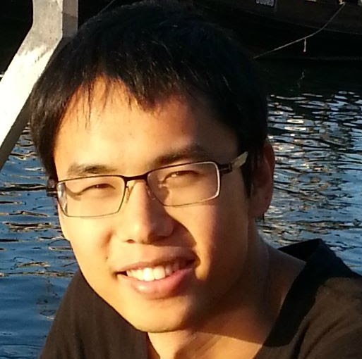

周毅，[电子科技大学计算机科学与工程学院](https://www.scse.uestc.edu.cn/index.htm)副教授，电子科技大学[算法与逻辑实验室](https://tcsuestc.com/)成员。

我于2017在法国[昂热大学](https://www.univ-angers.fr/fr/index.html)获得博士学位，导师为[Jin-Kao HAO教授](https://leria-info.univ-angers.fr/~jinkao.hao/)和[Adrien Goëffon教授](https://leria-info.univ-angers.fr/~adrien.goeffon/)，2013和2010在电子科技大学分别获得硕士和学士学位。

:material-email:邮箱:  zhou.yi[at]uestc[dot]edu[dot]cn

# 研究方向

我的研究方向主要是组合优化算法，包括算法理论和算法实验。我们主要探索了以下问题：

- 图问题：团问题、Steiner树, 网络控制等优化问题等
- 工业优化问题：卫星调度、生产套料
- AI中的优化问题：次模优化，决策树
- LLM在优化算法中的应用
 

具体内容的可参考我的[DBLP](https://dblp.org/pid/01/1901-16.html)或者[google scholar](https://scholar.google.com/citations?user=8MvNCXAAAAAJ) 页面。
<!-- [:material-file-sign:论文发表](research/publication.md) 或者 -->

# 算法工程小组
- 我指导了[UESTC算法工程小组](aegroup/aegroup_zh.md)，由对算法、程序设计、人工智能搜索等技术有强烈兴趣的本科、硕士、博士生组成。
- 小组氛围融洽，每周都有组内交流讨论，此外大团队还会不定期邀请海内外顶尖院士、专家进行[Seminar](https://tcsuestc.com/seminars/)。
- 团队主要培养学生发表顶级科研论文。目前本科生已培养了2名成电杰出学生（电子科大最高荣誉），研究生培养出华为天才少年，校级优秀毕业论文，国家一等奖学金等多项荣誉获得者。
- 学生毕业几乎全部进入了国内外顶尖高校继续深造，或者进入了华为、阿里巴巴、字节跳动等知名企业从事算法研发工作。

<mark>** TIPS: 在考研保研高峰期可能老师无法一一回复。如果在邮件中多谈论一些对我具体论文的理解，会更容易得到回复。**<mark>

<mark>** TIPS: 本校本科生如何加入算法工程小组？参考[<u>加入建议</u>](aegroup/aegroup.md#suggestions-for-future-students)**<mark>

# 研究项目
主持国家自然基金青年项目、面上项目，CCF-华为胡杨林基金，多个研究所、企业的实验室开放课题。

# 教学
+ 2025秋: 高级算法分析与设计，研究生选修课
+ 2025秋：[<u>最优化算法</u>](course/optimization.md)，核心选修课（珠峰必修课）
+ 2018秋-2024秋：最优化算法，本科生课程。
+ 2018秋-2023秋： 大数据专题，本科生课程（创新创业学院）。
+ 2022春，2022秋，2023秋：高级算法设计与分析，研究生选修课

