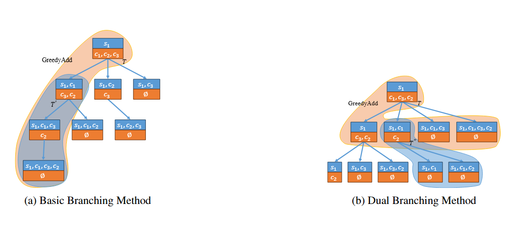
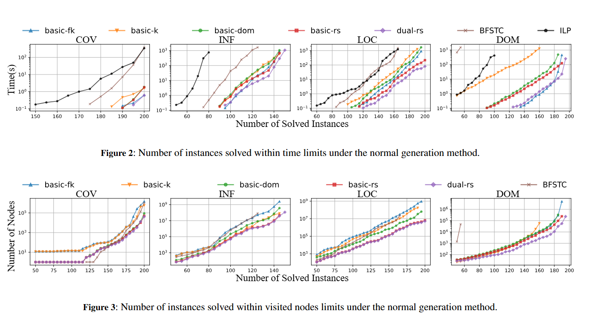

# 🌟 Efficient Branch-and-Bound for Submodular Maximization under Knapsack Constraint

*Yimin Hao, Yi Zhou, Chao Xu, Zhang-Hua Fu*

University of Electronic Science and Technology of China, \
Shenzhen Institute of Artificial Intelligence and Robotics for Society


## 🧩 Abstract

We study the **Submodular Knapsack Problem (SKP)** — maximizing a monotone submodular function under a budget. We propose an **exact branch-and-bound** method with a **refined subset upper bound** (tight worst-case guarantee) and a **dual branching** strategy that halves repeated computations. On canonical applications (facility location, weighted coverage, influence maximization, partial dominating set), our method **significantly outperforms** existing exact solvers. 

---

## 🚀 Why it matters

Submodular maximization models real decisions with diminishing returns (e.g., **health-care facility location**, **risk-sensitive planning**, **influence maximization**). In many high-stakes settings, **optimality** is crucial—approximate solutions can be insufficient. Hence the need for **fast exact** algorithms. 

---

## 🔥 Highlights (What’s new)

* **Refined Subset Bound (RS)**
  A new upper bound that leverages the greedy expansion sequence; **theoretically ≤ 1/(1−e⁻¹) ≈ 1.582× OPT** when weights are small vs. budget, and **empirically tighter** than prior bounds (domination / fractional-knapsack). 

* **Dual Branching Method**
  Reuses marginal-gain computations from greedy steps, avoiding recomputation across sibling nodes; **~2× average speed-up** vs. basic branching. 



<!--
## Method at a glance

**Branch-and-Bound** framework with:

1. **Greedy primal heuristic** for quick feasible LB;
2. **RS upper bound** computed along the greedy sequence;
3. **Dual branching** to minimize repeated gain computations;
4. **Lazy updates & reductions** to cut search space. 
 
 ### 🔀 Basic vs Dual Branching（论文 Figure 1）
-->

* **Practical wins**
  Across 200 instances, **dual-rs** delivers the best overall runtime and visits the fewest nodes (especially on DOM). Competes strongly with or beats prior exact solvers (A* variants, ILP) and leading cardinality-specialized combinatorial solvers. 
---

## 📊 Experimental Results

### Benchmarks

Four standard submodular problems:

1. Weighted Coverage (COV)
2. Influence Maximization (INF)
3. Facility Location (LOC)
4. Partial Dominating Set (DOM)


## 🖼 Performance Comparison



Number of Instances Solved vs Time ( Branching nodes). The lower the better.The final algorithn __Dual-RS__ achieves the fastest convergence and solves the most instances within the time limit across all datasets.

---


 [Code and Data Link](https://github.com/Chhokmah0/submodKC)

---

## 🏅 Citation

If you use this work, please cite:

```bibtex
@misc{hao2025efficientbranchandboundsubmodularfunction,
      title={Efficient Branch-and-Bound for Submodular Function Maximization under Knapsack Constraint}, 
      author={Yimin Hao and Yi Zhou and Chao Xu and Zhang-Hua Fu},
      year={2025},
      eprint={2507.11107},
      archivePrefix={arXiv},
      primaryClass={cs.DS},
      url={https://arxiv.org/abs/2507.11107}, 
}
```
The paper will be presented at ECAI-2025.

---

*Last updated: October 2025*

---
